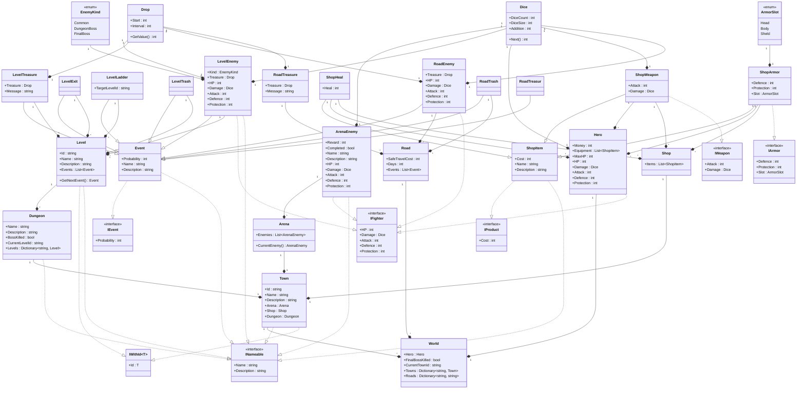

```mermaid
classDiagram

    %%%%%%%%%%
    %% misc %%
    %%%%%%%%%%

    class Dice {
        +DiceCount : int
        +DiceSize : int
        +Addition : int
        +Next() int
    }

    class Drop {
        +Start : int
        +Interval : int
        +GetValue() int
    }

    class Event {
        +Probability : int
        +Name : string
        +Description : string
    }

    %%%%%%%%%%%
    %% Arena %%
    %%%%%%%%%%%

    class Arena {
        +Enemies : List~ArenaEnemy~
        +CurrentEnemy() ArenaEnemy
    }

    class ArenaEnemy {
        +Revard : int
        +Completed : bool

        +Name : string
        +Description : string

        +HP : int
        +Damage : Dice
        +Attack : int
        +Defence : int
        +Protection : int
    }

    %%%%%%%%%%%%%
    %% Dungeon %%
    %%%%%%%%%%%%%

    class Dungeon {
        +Name : string
        +Description : string

        +BossKilled : bool
        +CurrentLevelId : string
        +Levels : Dictionary~string, Level~
    }

    class Level {
        +Id : string

        +Name : string
        +Description : string

        +Events : List~Event~
        +GetNextEvent() Event
    }

    class LevelEnemy {
        +Kind : EnemyKind
        +Treasure : Drop

        +HP : int
        +Damage : Dice
        +Attack : int
        +Defence : int
        +Protection : int
    }

    class LevelExit {
    }

    class LevelLadder {
        +TargetLevelId : string
    }

    class LevelTrash {
    }

    class LevelTreasure {
        +Treasure : Drop
        +Message : string
    }

    %%%%%%%%%%
    %% hero %%
    %%%%%%%%%%

    class Hero {
        +Money : int
        +Equipment : List~ShopItem~
        +MaxHP : int

        +HP : int
        +Damage : Dice
        +Attack : int
        +Defence : int
        +Protection : int
    }

    %%%%%%%%%%
    %% shop %%
    %%%%%%%%%%

    class Shop {
        +Items : List~ShopItem~
    }

    class ShopItem {
        +Cost : int

        +Name : string
        +Description : string
    }

    class ShopArmor {
        +Defence : int
        +Protection : int
        +Slot : ArmorSlot
    }

    class ShopHeal {
        +Heal : int
    }

    class ShopWeapon {
        +Attack : int
        +Damage : Dice
    }

    %%%%%%%%%%
    %% town %%
    %%%%%%%%%%

    class Town {
        +Id : string

        +Name : string
        +Description : string

        +Arena : Arena
        +Shop : Shop
        +Dungeon : Dungeon
    }

    %%%%%%%%%%%
    %% world %%
    %%%%%%%%%%%

    class World {
        +Hero : Hero
        +FinalBossKilled : bool
        +CurrentTownId : string
        +Towns : Dictionary~string, Town~
        +Roads : Dictionary~string, string~
    }

    class Road {
        +SafeTravelCost : int
        +Days : int
        +Events : List~Event~
    }

    class RoadEnemy {
        +Treasure : Drop

        +HP : int
        +Damage : Dice
        +Attack : int
        +Defence : int
        +Protection : int
    }

    class RoadTrash {        
    }

    class RoadTreasure {
        +Treasure : Drop
        +Message : string
    }

    %%%%%%%%%%%%%
    %% derived %%
    %%%%%%%%%%%%%

    LevelEnemy --|> Event
    LevelExit --|> Event
    LevelLadder --|> Event
    LevelTrash --|> Event
    LevelTreasure --|> Event
    ShopArmor --|> ShopItem
    ShopHeal --|> ShopItem
    ShopWeapon --|> ShopItem
    RoadEnemy --|> Event
    RoadTrash --|> Event
    RoadTreasur --|> Event

    %%%%%%%%%%%%%%%%%
    %% composition %%
    %%%%%%%%%%%%%%%%%

    Dice "1" --* "1" ArenaEnemy
    Dice "1" --* "1" LevelEnemy
    Dice "1" --* "1" Hero
    Dice "1" --* "1" ShopWeapon
    Dice "1" --* "1" RoadEnemy

    Drop "1" --* "1" LevelEnemy
    Drop "1" --* "1" LevelTreasure
    Drop "1" --* "1" RoadEnemy
    Drop "1" --* "1" RoadTreasure

    ShopArmor "1" --* "*" Hero
    ShopHeal "1" --* "*" Hero
    ShopWeapon "1" --* "*" Hero

    ShopArmor "1" --* "*" Shop
    ShopHeal "1" --* "*" Shop
    ShopWeapon "1" --* "*" Shop

    LevelEnemy "1" --* "*" Level
    LevelExit "1" --* "*" Level
    LevelLadder "1" --* "*" Level
    LevelTrash "1" --* "*" Level
    LevelTreasure "1" --* "*" Level

    EnemyKind "1" --* "1" LevelEnemy

    ArmorSlot "1" --* "1" ShopArmor

    ArenaEnemy "1" --* "*" Arena

    Level "1" --* "*" Dungeon

    Arena "1" --* "1" Town
    Shop "1" --* "1" Town
    Dungeon "1" --* "1" Town

    Hero "1" --* "1" World
    Town "1" --* "*" World
    Road "1" --* "*" World

    RoadEnemy "1" --* "*" Road
    RoadTrash "1" --* "*" Road
    RoadTreasure "1" --* "*" Road

    %%%%%%%%%%%%%%%%
    %% interfaces %%
    %%%%%%%%%%%%%%%%

    class IWithId~T~ {
        +Id : T
    }

    class IEvent {
        <<interface>>
        +Probability : int
    }

    class IProduct {
        <<interface>>
        +Cost : int
    }

    class INameable {
        <<interface>>
        +Name : string
        +Description : string
    }

    class IWeapon {
        <<interface>>
        +Attack : int
        +Damage : Dice
    }

    class IArmor {
        <<interface>>
        +Defence : int
        +Protection : int
        +Slot : ArmorSlot
    }

    class IFighter {
        <<interface>>
        +HP : int
        +Damage : Dice
        +Attack : int
        +Defence : int
        +Protection : int
    }

    %%%%%%%%%%%%%%%%%%%%
    %% interface impl %%
    %%%%%%%%%%%%%%%%%%%%

    Event ..|> IEvent
    Event ..|> INameable
    ArenaEnemy ..|> IFighter
    ArenaEnemy ..|> INameable
    Dungeon ..|> INameable
    Level ..|> IWithId~string~
    Level ..|> INameable
    LevelEnemy ..|> IFighter
    LevelEnemy ..|> INameable
    Hero ..|> IFighter
    ShopItem ..|> IProduct
    ShopItem ..|> INameable
    ShopArmor ..|> IArmor
    ShopWeapon ..|> IWeapon
    Town ..|> INameable
    Town ..|> IWithId~string~
    RoadEnemy ..|> IFighter

    %%%%%%%%%%%
    %% enums %%
    %%%%%%%%%%%

    class ArmorSlot {
        <<enum>>
        Head
        Body
        Sheld
    }

    class EnemyKind {
        <<enum>>
        Common
        DungeonBoss
        FinalBoss
    }

```